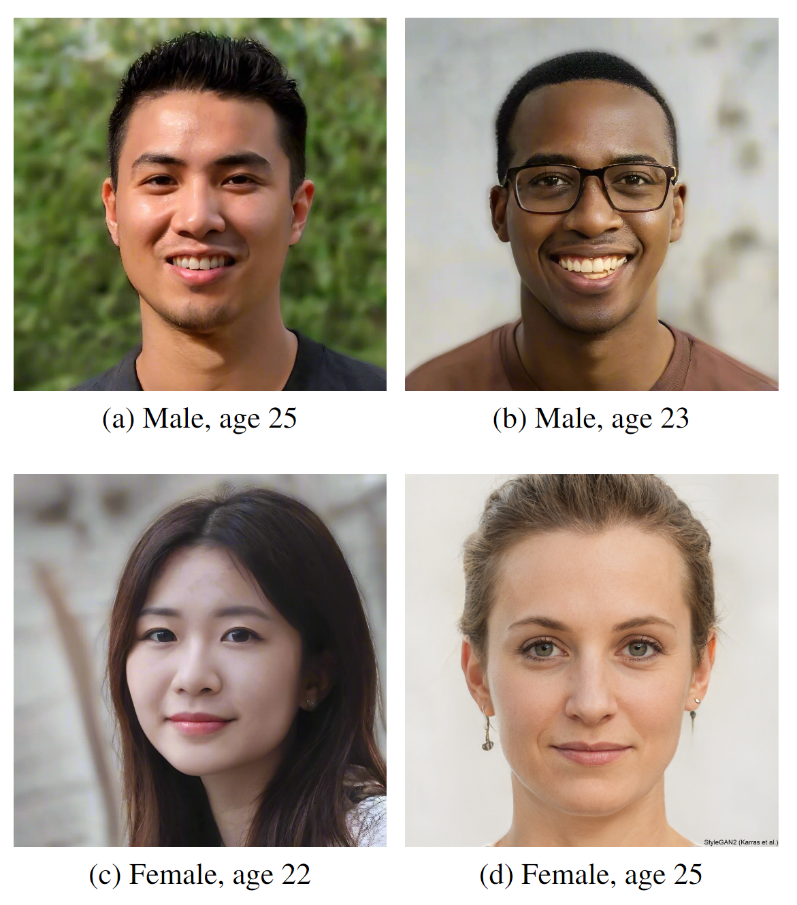

# Transformers cannot Recommend Love, not yet anyway

By enhancing personalization and privacy, recommender systems have been able to expand their
reach thanks to the development of artificial intelligence (AI) systems. In this work, we aim to
combine the representation of textual and visual data modalities into a single latent space and examine how the recommendation system functions. We employ cosine similarity
as the recommendation method in conjunction with the Flava model to extract multimodal embeddings. Using styleGANs for image generation and random selection from the typical
dating app questions, we create artificial personalities for users. Additionally, we experiment with
five text-only models including meta-llama-3-8B. Through feature analysis, we provide a framework for assessing a model’s comprehension of
the underlying structure of data. Despite their shortcomings, we discover that our results offer a fresh approach to user profile recommendations.


# Data
The dataset used for this study was custom made using Generative AI. 

Images we made using StyleGAN [link](https://thispersondoesnotexist.com/),

Text profiles were created using custom made traits prompted to GPT-4o





# Using this repo

## Recommendation
The recommendation system proposed for this study is available here - [reco.py](./recommendation/reco.py)

To perform recommendation and get performance statistics of the task, run [recommend.py](./recommendation/recommend.py)

## Clustering
Analysis of enbeddings clustered on certain "groups", e.g gender, height, hobbies, etc.

## Embeddings
This profile contains scripts to compute embeddings for different models.
The dataset required for the task is hosted [here](https://drive.google.com/file/d/1EJyXe1Lsb_HWtzlnQN5crsReOaTFdQYR/view?usp=sharing). Access is currently limited to LionMail users, please send a request if you are interested in gaining access.

## Dataset
[Generated Profiles](https://drive.google.com/file/d/1EJyXe1Lsb_HWtzlnQN5crsReOaTFdQYR/view?usp=sharing)

This folder contains scripts used to generate profiles and a feedback form to obtain user preferences.

# Instructions to run code
Each directory has been organized to include one part of the research workflow

```
root
├───clustering (Clustering embeddings computed based on metrics - height, hobbies, etc.)
├───dataset (Creation of dataset)
├───embeddings (Create embeddings of profiles from dataset using Multimodal+Text models)
└───recommendation (Perform the recommendation task using profile embeddings and user feedback)
```

Each folder has separate instructions to run relevent code.
Please refer to the docs to download any data that is required to be used by a script (uploaded on gdrive).

## Contact
The authors' contact information in case of further queries:
```
as7458@columbia.edu
pkk2125@columbia.edu
```